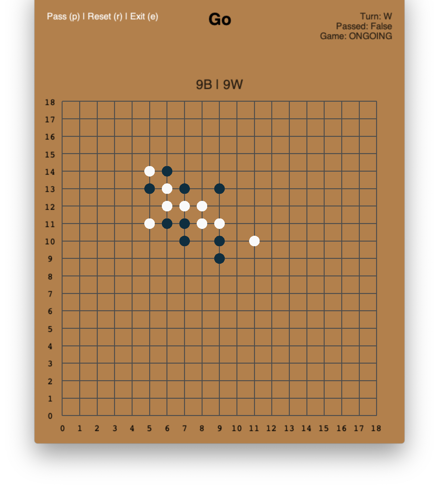

# About
An environment for the board game Go. It is implemented using OpenAI's Gym API.

# Installation
```bash
# In the root directory
pip install -e .
```

# Example
```bash
# In the root directory
python3 demo.py
```


# Code Example
```python
import gym

go_env = gym.make('gym_go:go-v0', size=7, reward_method='real')

first_action = (2,5)
second_action = (5,2)
state, reward, done, info = go_env.step(first_action)
go_env.render('terminal')
```

```
    0   1   2   3   4   5   6
  -----------------------------
0 |   |   |   |   |   |   |   |
  -----------------------------
1 |   |   |   |   |   |   |   |
  -----------------------------
2 |   |   |   |   |   | B |   |
  -----------------------------
3 |   |   |   |   |   |   |   |
  -----------------------------
4 |   |   |   |   |   |   |   |
  -----------------------------
5 |   |   |   |   |   |   |   |
  -----------------------------
6 |   |   |   |   |   |   |   |
  -----------------------------
	Turn: WHITE, Last Turn Passed: False, Game Over: False
	Black Area: 49, White Area: 0, Reward: 0
```

```python
state, reward, done, info = go_env.step(second_action)
go_env.render('terminal')
```

```
    0   1   2   3   4   5   6
  -----------------------------
0 |   |   |   |   |   |   |   |
  -----------------------------
1 |   |   |   |   |   |   |   |
  -----------------------------
2 |   |   |   |   |   | B |   |
  -----------------------------
3 |   |   |   |   |   |   |   |
  -----------------------------
4 |   |   |   |   |   |   |   |
  -----------------------------
5 |   |   | W |   |   |   |   |
  -----------------------------
6 |   |   |   |   |   |   |   |
  -----------------------------
	Turn: BLACK, Last Turn Passed: False, Game Over: False
	Black Area: 1, White Area: 1, Reward: 0
```

# Scoring
We use simple area scoring to determine the winner. A player's _area_ is defined as the number of empty points a 
player's pieces surround plus the number of player's pieces on the board. The _winner_ is the player with the larger 
area (a game is tied if both players have an equal amount of area on the board).

# Game Ending
A game ends when both players pass consecutively

# Reward Methods
Reward methods are in _black_'s perspective
* **Real**:
  * If game ended:
    * `-1` - White won
    * `0` - Game is tied
    * `1` - Black won
  * `0` - Otherwise
* **Heuristic**: If the game is ongoing, the reward is `black area - white area`. 
If black won, the reward is `BOARD_SIZE**2`. 
If white won, the reward is `-BOARD_SIZE**2`.
If tied, the reward is `0`.

# State
The `state` object that is returned by the `reset` and `step` functions of the environment is a 
`6 x BOARD_SIZE x BOARD_SIZE` numpy array. All values in the array are either `0` or `1` 
* **First and second channel:** represent the black and white pieces respectively.
* **Third channel:** Indicator layer for whose turn it is 
* **Fourth channel:** Invalid moves (including ko-protection) for the next action
* **Fifth channel:** Indicator layer for whether the previous move was a pass
* **Sixth channel:** Indicator layer for whether the game is over

# Action
The `step` function takes in the action to execute and can be in the following forms:
* a tuple/list of 2 integers representing the row and column or `None` for passing
* a single integer representing the action in 1d space (i.e 9 would be (1,2) in and 49 would be a pass for a 7x7 board)
